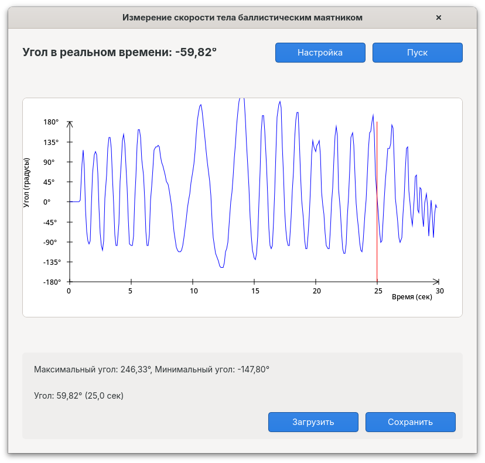

# Maitnik - Измерение скорости тела баллистическим маятником


## Описание

Программа "Maitnik" предназначена для измерения скорости тела с использованием баллистического маятника. Приложение получает данные с Arduino через последовательный порт, обрабатывает их и визуализирует угловые отклонения маятника на графике в режиме реального времени.

## Характеристики программы

- Визуализация угла маятника в реальном времени
- Построение графика зависимости угла от времени
- Автоматическое определение максимального и минимального углов
- Возможность навигации по графику с помощью курсора
- Сохранение и загрузка измерений в формате CSV
- Автоматическое определение подключенного устройства Arduino
- Современный пользовательский интерфейс на базе GTK 4

## Скриншот



## Требования к системе

### Программное обеспечение
- Linux (рекомендуется Ubuntu 20.04+ или другой современный дистрибутив)
- GTK 4.0 или выше
- Vala компилятор (valac) версии 0.48 или выше
- Библиотека POSIX
- Права администратора (для доступа к последовательному порту)

### Аппаратное обеспечение
- Arduino с загруженной соответствующей прошивкой
- Датчик угла наклона, подключенный к Arduino
- Баллистический маятник

## Установка

### Установка зависимостей

На Ubuntu/Debian:
```bash
sudo apt install valac libgtk-4-dev build-essential
```

На Fedora:
```bash
sudo dnf install vala gtk4-devel gcc make
```

На Arch Linux:
```bash
sudo pacman -S vala gtk4 base-devel
```

### Компиляция и установка из исходников

1. Клонируйте репозиторий или распакуйте архив с исходным кодом:
   ```bash
   git clone https://github.com/danayer/Maitnik.git
   cd maitnik
   ```

2. Скомпилируйте программу с помощью Makefile:
   ```bash
   make
   ```

3. Установите программу в системные директории (опционально):
   ```bash
   sudo make install
   ```

4. Запустите программу:
   ```bash
   # Если программа установлена
   maitnik
   
   # Или из директории проекта
   sudo ./maitnik
   ```

## Использование AppImage

AppImage - это формат упаковки, который не требует установки и включает в себя все необходимые зависимости. Для использования AppImage:

1. **Загрузка готового AppImage:** 
   - Скачайте файл `Maitnik-x86_64.AppImage` с [официальной страницы релизов](https://github.com/danayer/maitnik/releases).
   - Сделайте файл исполняемым:
     ```bash
     chmod +x Maitnik-x86_64.AppImage
     ```
   - Запустите программу:
     ```bash
     ./Maitnik-x86_64.AppImage
     ```

2. **Создание собственного AppImage:**
   - Убедитесь, что у вас установлены необходимые инструменты для сборки:
     ```bash
     sudo apt install wget make valac libgtk-4-dev
     ```
   - Выполните скрипт сборки AppImage:
     ```bash
     bash build-appimage.sh
     ```
   - После успешного завершения сборки у вас появится файл `Maitnik-x86_64.AppImage`

AppImage автоматически будет запрашивать повышение привилегий (через pkexec) для доступа к последовательным портам.

## Использование

### Запуск программы

Программу необходимо запускать с правами администратора для доступа к портам Arduino:

```bash
sudo maitnik
```

При первом запуске программа автоматически обнаружит подключенный Arduino и начнет получать данные.

### Основное окно программы

- **Угол в реальном времени** - отображает текущее значение угла с датчика
- **Кнопка "Настройка"** - отправляет сигнал сброса на Arduino для выставления нуля
- **Кнопка "Пуск/Стоп"** - начинает/останавливает запись показаний
- **График** - визуализирует изменение угла во времени (до 30 секунд измерений)
- **Максимальный/минимальный угол** - отображает экстремумы измерений
- **Курсорная информация** - показывает значение в точке, на которую наведен курсор
- **Кнопки "Сохранить/Загрузить"** - для работы с файлами данных

### Процесс измерения

1. Подключите Arduino с датчиком к компьютеру
2. Запустите программу с правами администратора
3. Настройте начальное положение маятника (кнопка "Настройка")
4. Нажмите "Пуск" для начала записи измерений
5. Произведите измерение (например, запустите маятник)
6. После завершения измерения нажмите "Стоп" или дождитесь автоматической остановки (через 30 секунд)
7. Анализируйте данные на графике или сохраните их для дальнейшей обработки

### Работа с файлами

Программа поддерживает формат CSV для сохранения и загрузки данных:

- **Сохранение**: Нажмите кнопку "Сохранить", укажите имя файла и расположение
- **Загрузка**: Нажмите кнопку "Загрузить" и выберите ранее сохраненный файл

Формат файла CSV:
```
# Максимальный угол: XX.XX
# Минимальный угол: YY.YY
# Время,Угол
0.0,XX.XX
0.1,XX.XX
...
```

## Подключение Arduino

### Требования к прошивке Arduino

Arduino должен передавать данные в следующем формате:
```
Угол: XX.XX
```

где XX.XX - значение угла в градусах.

### Настройка портов

Программа автоматически ищет Arduino на следующих портах:
- /dev/ttyACM0
- /dev/ttyACM1
- /dev/ttyUSB0
- /dev/ttyUSB1
- /dev/arduino

Для добавления нестандартных портов, отредактируйте массив `ports` в файле `maitnik.vala`.

### Протокол обмена с Arduino

- **Получение данных**: программа читет строки, отправляемые Arduino
- **Отправка команд**: программа может отправлять символ 'n', чтобы сбросить показания

## Структура проекта

```
maitnik/
├── maitnik.vala   - исходный код программы
├── Makefile       - файл сборки
├── Maitnik.ino    - файл arduino
├── README.md      - документация
└── screenshots/   - папка со скриншотами для документации
```

## Расширение функциональности

### Добавление новых функций

Для расширения функциональности программы рекомендуется ознакомиться со следующими файлами:

1. `maitnik.vala` - основной исходный код программы
   - Класс `MaitnikApp` содержит всю логику приложения
   - Функция `draw_graph` отвечает за отрисовку графика
   - Функция `update_angle` обрабатывает данные с Arduino

### Настройка и компиляция с дополнительными опциями

Компиляция с отладочной информацией:
```bash
make debug
```

Оптимизированная сборка:
```bash
make release
```

## Решение проблем

### Программа не видит Arduino

1. Убедитесь, что Arduino физически подключен к компьютеру
2. Проверьте, что Arduino определяется системой:
   ```bash
   ls /dev/tty*
   ```
3. Убедитесь, что у вас есть права на доступ к порту:
   ```bash
   sudo chmod a+rw /dev/ttyACM0  # или другой порт
   ```
4. Проверьте, что прошивка Arduino отправляет данные в правильном формате

### Настройка прав доступа к Arduino без прав администратора

Чтобы программы могли работать с платой без прав администратора, можно добавить следующее правило в файл:

```bash
sudo nano /etc/udev/rules.d/99-arduino.rules
```

Добавьте в файл следующую строку:
```bash
SUBSYSTEM=="tty", ATTRS{idVendor}=="2341", ATTRS{idProduct}=="0043", MODE="0666", GROUP="dialout"
```

### Ошибка компиляции

1. Убедитесь, что установлены все зависимости
2. Проверьте версию GTK (должна быть 4 или выше):
   ```bash
   pkg-config --modversion gtk4
   ```
3. Проверьте версию компилятора Vala:
   ```bash
   valac --version
   ```

### Программа запускается, но нет данных

1. Проверьте, что Arduino отправляет данные в правильном формате
2. Откройте последовательный порт программой для мониторинга:
   ```bash
   screen /dev/ttyACM0 9600
   ```
3. Убедитесь, что датчик на Arduino работает корректно

## Дополнительные ресурсы

- [Документация по GTK 4](https://docs.gtk.org/gtk4/)
- [Руководство по Vala](https://wiki.gnome.org/Projects/Vala)
- [Работа с Arduino в Linux](https://www.arduino.cc/en/Guide/Linux)

## Лицензия

Данная программа распространяется под лицензией GPL v3.

## Авторы

- Автор: Danayer
- Контактный email: DanayerOfficial@yandex.ru

## Участие в разработке

Приветствуются предложения по улучшению программы! Для участия в разработке:

1. Форкните репозиторий
2. Создайте ветку с новой функциональностью (`git checkout -b feature/amazing-feature`)
3. Зафиксируйте изменения (`git commit -m 'Add some amazing feature'`)
4. Опубликуйте изменения (`git push origin feature/amazing-feature`)
5. Создайте Pull Request
